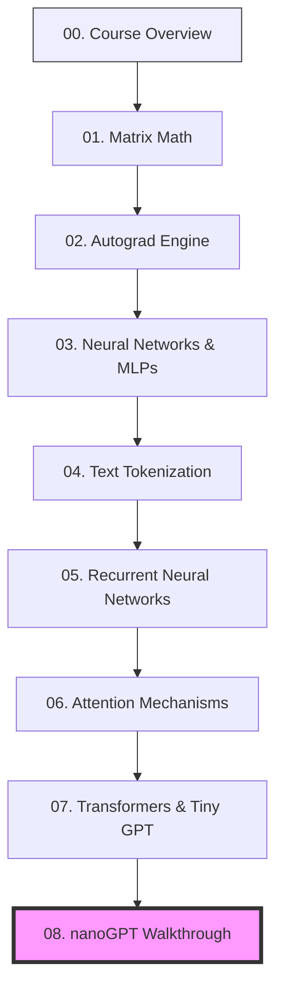

# 🎓 Course Overview: From Matrix Math to nanoGPT

**TLDR:** An overview of the module and what you will learn.

Welcome to the **Basics of Deep Learning & Language Models** curriculum! 

This educational path is structured as a sequential ladder. Each step covers a fundamental building block of modern Large Language Models (LLMs). Rather than using high-level libraries, you will write the math and structure of each component in pure Python or minimal PyTorch to truly understand how they work.

---

## 🗺️ The Learning Ladder

Click on any step below to open its dedicated deep-dive tutorial. We recommend following them in this exact order:

---

## 🗂️ Curriculum Syllabus

### [01. Matrix Math Foundations](01_matrix_math.md)
* **What you'll learn**: Scalars, vectors, matrices, dot products, matrix multiplications, transpose, mean, and variance.
* **Code implemented in**: [matrix.py](../src/matrix.py)

### [02. Autograd Engine](02_autograd.md)
* **What you'll learn**: Computational graphs, forward/backward passes, derivatives, partial derivatives, the chain rule, and topological sorting.
* **Code implemented in**: [autograd.py](../src/autograd.py)

### [03. Neural Networks & MLPs](03_neural_networks.md)
* **What you'll learn**: Neurons, weights, biases, activations (ReLU, Tanh, Sigmoid), Multi-Layer Perceptrons (MLPs), loss functions, and optimization via gradient descent.
* **Code implemented in**: [nn.py](../src/nn.py)

### [04. Text Tokenization](04_tokenizers.md)
* **What you'll learn**: String preprocessing, character-level vocabularies, subword tokenization, and training/encoding with Byte Pair Encoding (BPE).
* **Code implemented in**: [tokenizer.py](../src/tokenizer.py)

### [05. Recurrent Neural Networks (RNNs)](05_recurrent_neural_networks.md)
* **What you'll learn**: Sequential processing, hidden states, recurrent transitions, character-level prediction, and autoregressive generation loops.
* **Code implemented in**: [sequence.py](../src/sequence.py)

### [06. Attention Mechanisms](06_attention_mechanisms.md)
* **What you'll learn**: Query, Key, and Value vectors, scaled dot-product attention, attention weights, causal masking, and Multi-Head Attention.
* **Code implemented in**: [attention.py](../src/attention.py)

### [07. Transformers & Tiny GPT](07_transformers_and_gpt.md)
* **What you'll learn**: Feed-Forward Networks, Layer Normalization (Pre-LN), Residual (skip) connections, Transformer Blocks, and Decoder-only architectures.
* **Code implemented in**: [gpt.py](../src/gpt.py)

### [08. nanoGPT Walkthrough](08_nanogpt_walkthrough.md)
* **What you'll learn**: Scaling up our implementations to match Andrej Karpathy's `model.py` and `train.py` (dropout, learning rate decay, mixed precision, and GPU acceleration).
