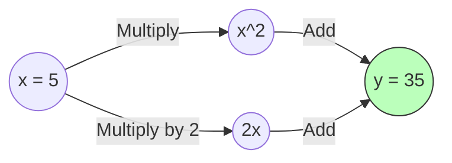

# 🎛️ Tutorial 02: Autograd Engine

**TLDR:** How automatic differentiation engines track and compute gradients.

In deep learning, we optimize models by adjusting parameters to minimize a scalar loss. The directions of these adjustments are calculated using derivatives. An **Autograd Engine** automatically computes these derivatives by traversing the mathematical operations performed during training.

---

## 1. Calculus Foundations

### Derivatives and Gradients
* **Derivative**: Represents the rate of change of a function. For $y = f(x)$, the derivative $\frac{dy}{dx}$ tells us how much $y$ changes with a tiny change in $x$.
* **Partial Derivative**: When a function has multiple variables (e.g. $z = f(x, y)$), the partial derivative $\frac{\partial z}{\partial x}$ measures the change in $z$ while keeping $y$ constant.

### The Chain Rule
If variable $z$ depends on $y$, which depends on $x$, then the rate of change of $z$ with respect to $x$ is the product of the intermediate rates:
$$\frac{dz}{dx} = \frac{dz}{dy} \cdot \frac{dy}{dx}$$

This rule enables us to backpropagate errors through long sequences of mathematical layers.

---

## 2. Computational Graphs

Every expression we code is represented internally as a **Directed Acyclic Graph (DAG)** of operations.



During the **Forward Pass**, we compute the numerical values from left to right.
During the **Backward Pass**, we propagate gradients from right to left using the chain rule.

---

## 3. Designing a Custom Autograd Engine

To build an autograd engine, we wrap raw floating point numbers in a class (which we call `Value`) that contains:
1. `data`: The numerical value of the node.
2. `grad`: The accumulated derivative of the final output with respect to this node ($\frac{\partial \text{loss}}{\partial \text{node}}$).
3. `_prev`: A set of parent nodes that were combined to produce this node.
4. `_backward`: A local function that applies the local derivative and pushes gradients to parents.

### Dynamic Backward Hook Example
When we multiply two nodes, we define how their gradients are calculated during backpropagation:
```python
def __mul__(self, other):
    other = other if isinstance(other, Value) else Value(other)
    out = Value(self.data * other.data, (self, other), '*')

    def _backward():
        # d(u*v)/du = v, so self.grad += other.data * out.grad
        self.grad += other.data * out.grad
        other.grad += self.data * out.grad
    out._backward = _backward

    return out
```

---

## 4. Topological Sorting
To compute gradients for all nodes correctly, we must process nodes in reverse topological order. This ensures that a node is only evaluated *after* all the nodes that depend on it have sent their gradients.

We implement topological sorting using a depth-first search (DFS):
```python
topo = []
visited = set()
def build_topo(v):
    if v not in visited:
        visited.add(v)
        for child in v._prev:
            build_topo(child)
        topo.append(v)
```
After sorting, we set the loss node's gradient to `1.0` and iterate backward through the list, calling `node._backward()`.

*Code reference*: [autograd.py](../src/autograd.py)

---

## 💡 Practical Challenge
Open [autograd.py](../src/autograd.py) and run the demo script. Try tracking a complex equation like $f = a \cdot b + c^2$ by hand, compute the partial derivatives, and then print them using `Value` to verify that your hand-calculated math matches the engine.
