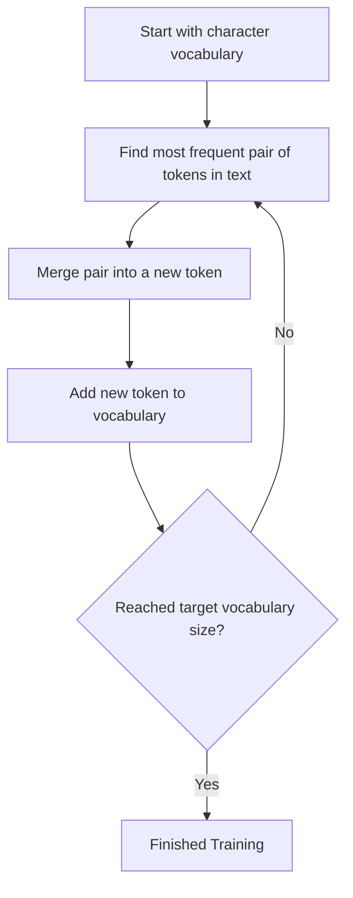

# 🔤 Tutorial 04: Text Tokenization

**TLDR:** Converting text into numbers using various tokenization strategies.

Computes only process numbers. Before a language model can read or write text, we must translate text (strings) into lists of integers (tokens). This process is handled by a **Tokenizer**.

---

## 1. Character-Level Tokenization

The simplest approach is mapping every unique character (letters, spaces, punctuation) to a unique integer ID.

```text
Input text: "hi!"
Characters: ['h', 'i', '!']
Vocabulary mapping: {'h': 0, 'i': 1, '!': 2}
Token IDs: [0, 1, 2]
```

### Trade-offs
* **Pros**: 
  - Vocabulary size is very small (typically under 100 characters for English).
  - Out-of-vocabulary (UNK) tokens never occur, as every character can be encoded.
* **Cons**:
  - Sentences generate very long lists of IDs, which makes it computationally expensive for model context windows.
  - The model has to learn how to spell words from scratch.

*Code reference*: [`CharTokenizer` in tokenizer.py](../src/tokenizer.py#L1-L20)

---

## 2. Byte Pair Encoding (BPE)

Modern language models (like GPT, LLaMA) use **subword tokenization**, which balances characters and words. BPE is a subword tokenization algorithm that starts with characters and iteratively builds a vocabulary by merging the most frequent adjacent pairs.



### Walkthrough of BPE Training
Imagine we have the text `"banana bandanna"`.
1. **Initial Characters**: `{'b', 'a', 'n', 'd', ' '}`.
2. **First Merge**: The pair `'a' + 'n'` appears frequently in `"an"` and `"na"`. Let's merge `'a'` (ID 1) and `'n'` (ID 2) into a new token `'an'` (ID 6).
3. **Subsequent Merges**: The pair `'an' + 'n'` or `'an' + 'a'` will be merged next if they are frequent.
4. **Result**: Words like `"banana"` will be split into larger chunks like `['b', 'an', 'ana']`, reducing sequence length!

---

## 3. BPE Encoding and Decoding

* **Encoding**: Given a new string, we first break it down into character tokens. We then scan the sequence and apply our learned merges in the exact order they were trained (priority order).
* **Decoding**: To translate tokens back to text, we lookup each token ID in the vocabulary dictionary and concatenate the corresponding bytes or characters.

*Code reference*: [`BPETokenizer` in tokenizer.py](../src/tokenizer.py#L23-L113)

---

## 💡 Practical Challenge
Run `task run -- src/tokenizer.py`. Look at the merges printed in the terminal. Try training the tokenizer on a different corpus of text and check how the merged vocabularies adapt to the text style!
