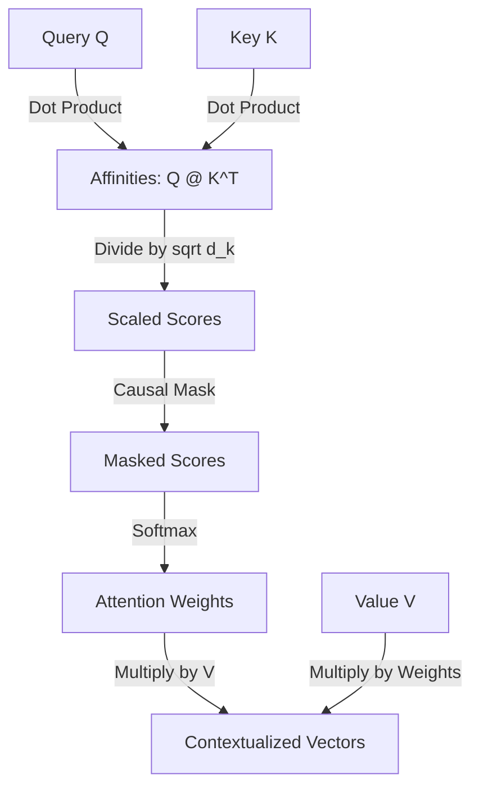

# 🔍 Tutorial 06: Attention Mechanisms

**TLDR:** Understanding how attention allows models to focus on relevant context.

To solve the sequential bottleneck and memory limits of RNNs, the Transformer architecture replaces recurrence entirely with **Attention**. Attention allows every token in a sequence to directly look at and retrieve information from all other tokens in the sequence, regardless of distance.

---

## 1. Query, Key, and Value Projections

The attention mechanism uses a database lookup analogy:
* **Query (Q)**: What information the current token is seeking.
* **Key (K)**: The tags/labels that describe what information each token in the sequence contains.
* **Value (V)**: The actual content that is retrieved once a query matches a key.

For a sequence, we project the input embeddings into Query, Key, and Value spaces using linear layers:
$$\mathbf{Q} = \mathbf{X} \mathbf{W}_q, \quad \mathbf{K} = \mathbf{X} \mathbf{W}_k, \quad \mathbf{V} = \mathbf{X} \mathbf{W}_v$$

---

## 2. Scaled Dot-Product Attention

Once projections are calculated, we perform the attention mathematical operations:

$$Attention(\mathbf{Q}, \mathbf{K}, \mathbf{V}) = \text{softmax}\left(\frac{\mathbf{Q} \mathbf{K}^T}{\sqrt{d_k}}\right) \mathbf{V}$$



### Why Scale by $\sqrt{d_k}$?
If the dimensionality $d_k$ of the keys is large, the dot products grow large in magnitude. This pushes the softmax function into regions with extremely small gradients (saturation). Scaling by dividing by $\sqrt{d_k}$ stabilizes the values.

---

## 3. Causal Masking

In a generative (decoder-only) model, a token must only be allowed to look at past tokens, not future ones. 

To enforce this, we set the affinities of future tokens to $-\infty$ before calculating the softmax. When softmax is applied, $e^{-\infty} = 0$, completely blocking information flow from future tokens.

We implement this using a lower-triangular matrix:
$$\mathbf{M} = \begin{bmatrix} 0 & -\infty & -\infty \\ 0 & 0 & -\infty \\ 0 & 0 & 0 \end{bmatrix}$$

*Code reference*: [`CausalSelfAttentionHead` in attention.py](../src/attention.py#L5-L42)

---

## 4. Multi-Head Attention

A single attention head calculates one set of relationships. To let the model attend to different parts of the sentence in parallel (e.g. tracking subject-verb relationships in head 1, and adjectives in head 2), we run multiple attention heads in parallel.

$$\text{MultiHead}(\mathbf{Q}, \mathbf{K}, \mathbf{V}) = \text{Concat}(\text{head}_1, \dots, \text{head}_h) \mathbf{W}^O$$

```text
Input (B, T, n_embd)
  ├── Head 1 ──> (B, T, head_size) ──┐
  ├── Head 2 ──> (B, T, head_size) ──┼─> Concat ──> (B, T, n_embd) ──> Linear Projection
  └── Head N ──> (B, T, head_size) ──┘
```

*Code reference*: [`MultiHeadAttention` in attention.py](../src/attention.py#L44-L71)

---

## 💡 Practical Challenge
Open [attention.py](../src/attention.py). Run the demo and check the printed attention weight matrix. Observe how the upper triangle values are zero. Try changing the input sequence and check how the weights update based on queries and keys.
