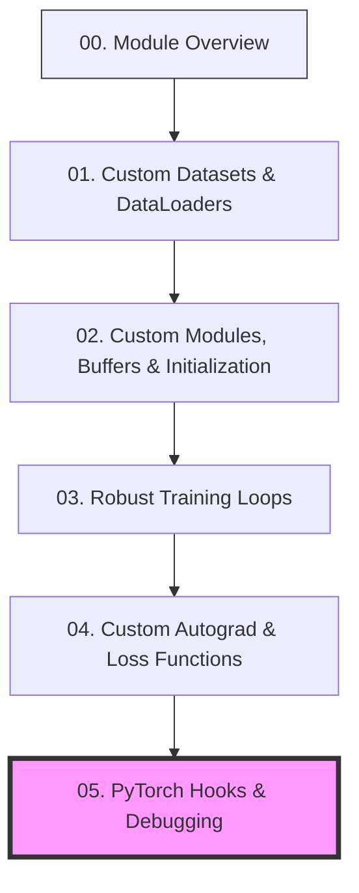

# 🎓 PyTorch Patterns: Advanced Deep Learning Workflows

**TLDR:** Visual overview and syllabus mapping for advanced PyTorch workflows.

Welcome to the **PyTorch Patterns** learning module! This project helps you transition from writing simple PyTorch scripts to designing flexible, production-ready deep learning code. 

By building these patterns, you will understand how PyTorch operates under the hood, enabling you to custom-pad datasets, track non-trainable states, write custom loss functions, and debug neural networks non-intrusively.

---

## 🗺️ The Learning Ladder

Follow this sequential ladder to master advanced PyTorch workflows:

---

## 📊 Summary of Learning Modules

| Lesson | Core Pattern | Visual Metaphor | Code Files |
|---|---|---|---|
| **01. Custom Datasets** | Dynamic Batch Padding | 📦 Packing boxes of different sizes into equal-sized containers | [dataset_text.py](../src/dataset_text.py) [collate_padding.py](../src/collate_padding.py) |
| **02. Custom Modules** | Parameters vs. Buffers | 🔋 Phone learning habits (weights) vs. tracking battery % (buffer) | [module_params.py](../src/module_params.py) [module_init.py](../src/module_init.py) |
| **03. Training Loops** | Cycle Checklist Control | 📋 Pilot's pre-flight, in-flight, and landing check sequences | [model_mlp.py](../src/model_mlp.py) [trainer_loop.py](../src/trainer_loop.py) |
| **04. Custom Autograd** | Backward Gradients Override | 🪞 Mirror reversing gravity (GRL) and teacher grading hard exams (Focal Loss) | [autograd_grl.py](../src/autograd_grl.py) [loss_focal.py](../src/loss_focal.py) |
| **05. PyTorch Hooks** | Non-Intrusive Inspection | 🎥 Security cameras recording packages without stopping the conveyor belt | [hooks_inspector.py](../src/hooks_inspector.py) |

---

## 🗂️ Curriculum Syllabus

### 📦 [01. Custom Datasets & DataLoaders](01_custom_datasets.md)
* **Concepts**: Character vocabulary mapping, dataset indexing, custom batch collators, and dynamic padding.
* **Code implemented in**: [dataset_text.py](../src/dataset_text.py) and [collate_padding.py](../src/collate_padding.py)

### 🔋 [02. Custom Modules, Buffers & Initialization](02_custom_modules.md)
* **Concepts**: Trainable parameter management, state buffers (`register_buffer`), and parameter weight initialization methods.
* **Code implemented in**: [module_params.py](../src/module_params.py) and [module_init.py](../src/module_init.py)

### 📋 [03. Robust Training Loops](03_training_loops.md)
* **Concepts**: Train/eval mode toggling, gradient accumulators/zeroing, gradient norm clipping, and validation steps.
* **Code implemented in**: [model_mlp.py](../src/model_mlp.py) and [trainer_loop.py](../src/trainer_loop.py)

### 🪞 [04. Custom Autograd & Loss Functions](04_custom_autograd_loss.md)
* **Concepts**: `torch.autograd.Function` overrides, custom backward paths, and imbalanced classification (Focal Loss).
* **Code implemented in**: [autograd_grl.py](../src/autograd_grl.py) and [loss_focal.py](../src/loss_focal.py)

### 🎥 [05. PyTorch Hooks & Debugging](05_pytorch_hooks.md)
* **Concepts**: Non-intrusive network introspection, forward/backward hooks, and tracking activation/gradient statistics.
* **Code implemented in**: [hooks_inspector.py](../src/hooks_inspector.py)
