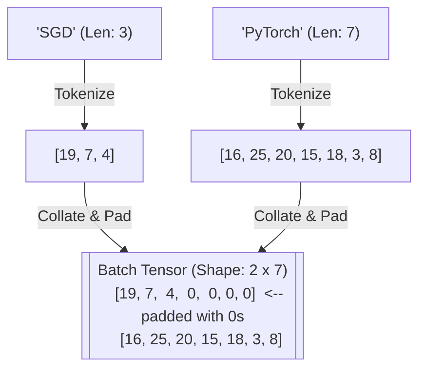

# 🧬 Tutorial 01: Custom Datasets & DataLoaders

**TLDR:** Padding variable-length sequence data using custom Datasets and batch collators.

When we process sequence data (like words, sentences, or audio), each input sample has a different length. However, GPUs need data arranged in tidy, rectangular grids (tensors) of equal dimensions to calculate quickly. 

We solve this using **Dynamic Padding**: taking variable-length sequences and padding them with a special character (like `<PAD>`) so they match the longest sequence in that specific batch.

---

## 📦 The Visual Metaphor: The Toy Packager
Imagine an assembly worker packing toys. If we try to stack a teddy bear, a toy car, and a bicycle into standard boxes of matching sizes, we must pad the empty space in the smaller boxes (using bubble wrap) to keep them secure. 

---

## 📊 Collation Strategy Comparison

| Collation Method | How it Works | Pros / Cons |
|---|---|---|
| **Default Collation (`default_collate`)** | Tries to stack tensors directly. | ❌ Crashes if sequence shapes do not match. |
| **Global Padding** | Pads all inputs to a pre-defined maximum length (e.g., 512). | ❌ Wasteful. Shorter batches waste GPU memory on padding computations. |
| **Dynamic Padding (`PadCollate`)** | Finds the maximum length *in this specific batch* and pads only to that length. |  Efficient and fast. Minimizes padding overhead. |

---

💡 Read about Dataset Mapping and Collate Protocol

### How it Works
1. **The Dataset (`TextSequenceDataset`)**:
   - `__len__`: Counts how many sentences we have.
   - `__getitem__`: Converts a sentence into numerical character IDs (e.g. `'cat'` becomes `[3, 1, 20]`).
2. **The Collator (`PadCollate`)**:
   - Inspects the sequences in the current batch.
   - Identifies the maximum length (e.g., if one is 5 tokens and another is 10, maximum is 10).
   - Fills the end of shorter tensors with `pad_idx` (0) so every tensor is exactly 10 tokens long.
   - Stacks them into a single 2D tensor of shape `(batch_size, max_len)`.

*Code reference*: [dataset_text.py](../src/dataset_text.py) and [collate_padding.py](../src/collate_padding.py)

---

## 💡 Practical Challenge
Open [dataset_text.py](../src/dataset_text.py) and execute it with `task pytorch-patterns:run -- src/dataset_text.py`. Try modifying the code or looking at [collate_padding.py](../src/collate_padding.py) to output an attention mask tensor indicating where actual tokens are (1) vs padding characters (0).

