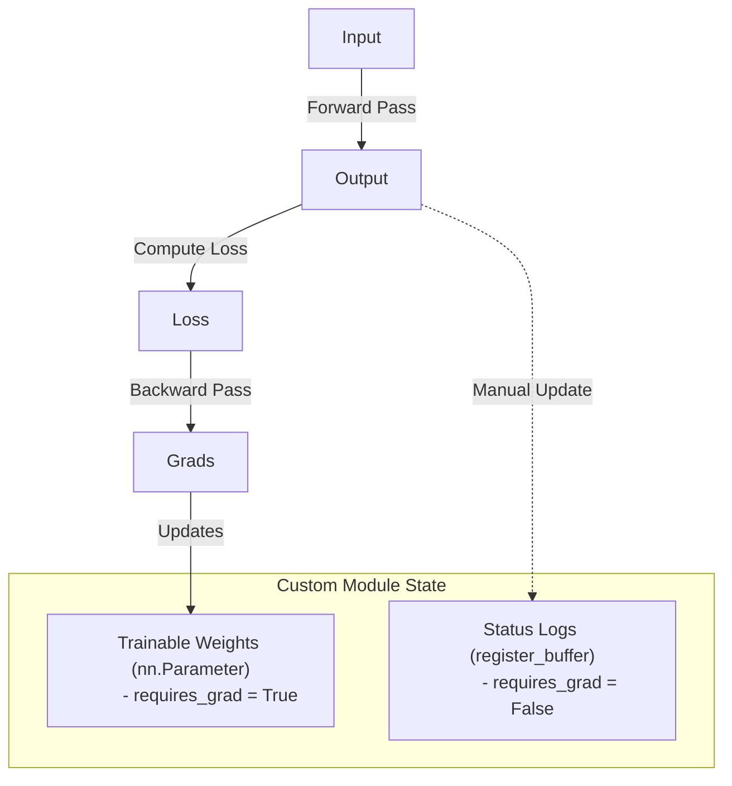

# 🧬 Tutorial 02: Custom Modules, Buffers & Initialization

**TLDR:** Managing trainable parameters, state tracking buffers, and custom weight initializations in nn.Module.

Every layer in a model is a subclass of `nn.Module`. To build advanced custom layers, we need to know the difference between state variables that change via learning (gradients) and state variables that change via simple tracking (buffers).

---

## 🔋 The Visual Metaphor: Smartphone Tracking
Think of a smartphone app that predicts what word you will type next:
- **Parameters**: The app's learning weights. They adjust over time (gradients) to get better at predicting your specific writing style.
- **Buffers**: The app's simple status logs. For instance, the step counter or battery percentage tracker. These values update manually in the background, but the app doesn't run "optimization math" on them to improve them.

---

## 📊 Parameters vs. Buffers Comparison

| Property | Trainable Parameter (`nn.Parameter`) | State Buffer (`register_buffer`) |
|---|---|---|
| **Gradient Tracking** |  Yes (`requires_grad = True`) | ❌ No (`requires_grad = False`) |
| **How It Updates** | Automatically by the Optimizer | Manually inside the `forward()` pass |
| **Saved in Checkpoints?** |  Yes (in `state_dict()`) |  Yes (in `state_dict()`) |
| **Moves with `.to(device)`?**|  Yes (e.g. CPU to GPU) |  Yes (e.g. CPU to GPU) |

---

💡 Read about Weight Initializations

Weights determine how signals flow through our network. If we initialize them incorrectly, signals can explode (grow too large) or vanish (die out).

### 📈 Initialization Strategies:
1. **Xavier (Glorot) Initialization**:
   - *Analogy*: Adjusts volume so input signal volume matches output signal volume.
   - *Best for*: Symmetric activations like Tanh or Sigmoid.
2. **Kaiming (He) Initialization**:
   - *Analogy*: Compensates for activation gates (like ReLU) that throw away half of the negative signals.
   - *Best for*: ReLU or LeakyReLU.
3. **Constant Initialization**:
   - Fills everything with a fixed number. Often used to initialize bias vectors to zero or a small positive value.

*Code reference*: [module_params.py](../src/module_params.py) and [module_init.py](../src/module_init.py)

---

## 💡 Practical Challenge
Run the code using `task pytorch-patterns:run -- src/module_params.py`. Modify `CustomLinear` to track and log the maximum activation magnitude seen so far across all steps inside `forward`, and save it using a registered buffer named `max_activation`.

