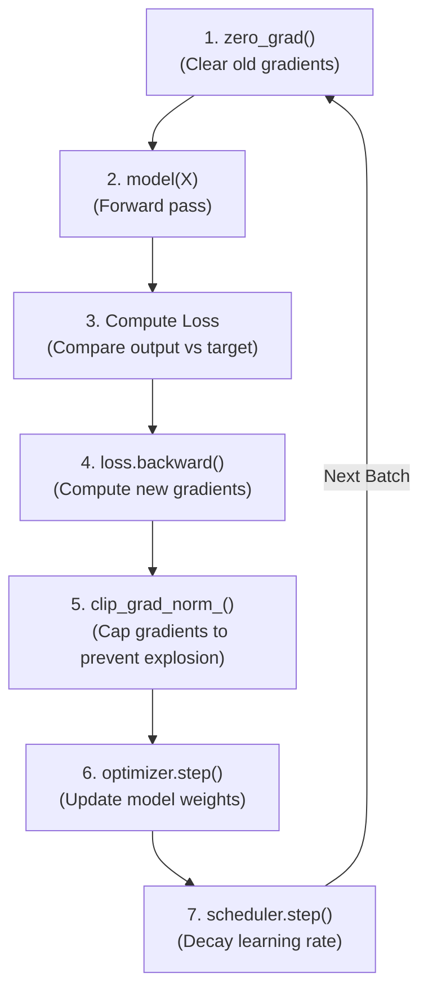

# 🧬 Tutorial 03: Robust Training Loops & Optimization

**TLDR:** Designing a safe, structured training loop with mode toggling, gradient clipping, and scheduler integrations.

A training loop is the orchestrator of deep learning. It feeds data to the model, evaluates performance, calculates weight corrections, and applies them. Skipping or misordering any step can stall training or create bugs.

---

## 📋 The Visual Metaphor: The Pilot's Checklist
Think of training a model like flying a plane. You don't just takeoff. You follow a strict sequence: check instrument dials (zero gradients), start the engine (forward pass), check destination path (calculate loss), adjust flaps (backward pass), limits controls (clip gradients), and move forward (optimizer step).

---

## 📊 Model Mode Comparison

| Mode / Context | `model.train()` (Training) | `model.eval()` (Evaluation/Inference) |
|---|---|---|
| **Dropout Layers** |  Enabled (Randomly drops neurons) | ❌ Disabled (Passes all neurons) |
| **Batch Normalization** |  Updates running averages | ❌ Freezes and uses running averages |
| **Gradient Tracking** |  Yes (necessary for learning) | ❌ Typically disabled via `torch.no_grad()` |

---

💡 Read about Gradient Accumulation and Clipping

### Why do we zero gradients?
In PyTorch, calling `loss.backward()` adds the new gradients to whatever gradients are already stored in the parameter's `.grad` field. This is called **gradient accumulation**. If we forget to call `optimizer.zero_grad()`, our steps will grow increasingly erratic, combining direction instructions across separate training steps.

### Why do we clip gradients?
During backpropagation, multiplying many small numbers can lead to gradients vanishing to zero. Conversely, multiplying large numbers can cause gradients to explode to infinity, tearing the model's weight adjustments apart.
- **Gradient Clipping** caps the gradient magnitude to a maximum norm (e.g. `1.0`), keeping weight updates stable.

*Code reference*: [model_mlp.py](../src/model_mlp.py) and [trainer_loop.py](../src/trainer_loop.py)

---

## 💡 Practical Challenge
Run the code using `task pytorch-patterns:run -- src/trainer_loop.py`. Try changing the optimizer in your tests or experiment files from `Adam` to `SGD` with momentum, and examine how the loss changes!

