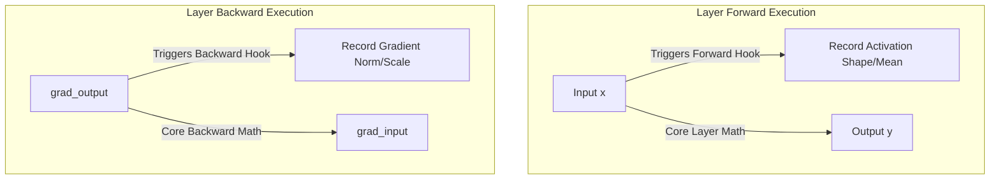

# 🧬 Tutorial 05: PyTorch Hooks & Debugging

**TLDR:** Attaching non-intrusive hooks to inspect layer activations and gradients at runtime.

When debugging models, we often want to inspect intermediate values (like activation values or gradient scales). Adding `print()` statements inside model files clutters the code. 

Instead, PyTorch has **Hooks**—temporary observation callbacks that you can attach to layers to inspect data packets silently.

---

## 🎥 The Visual Metaphor: Pipeline Cameras
Think of a model like a factory pipeline. Rather than stopping the conveyor belt and cutting open packages to inspect them, we mount high-speed inspection cameras (hooks) over specific sections of the line. The cameras snap photos of items passing through (forward hook) and labels on return shipments (backward hook) without interfering.

---

## 📊 Hook Type Comparison

| Hook Category | Forward Hook | Backward Hook |
|---|---|---|
| **Registration Method** | `register_forward_hook(fn)` | `register_full_backward_hook(fn)` |
| **Arguments Received** | `(module, input, output)` | `(module, grad_input, grad_output)` |
| **Trigger Point** | Immediately after `forward()` runs | During backpropagation of gradients |
| **Best Used For** | 🔍 Extracting intermediate activations/features | 📉 Diagnosing exploding/vanishing gradients |

---

💡 Read about hook rules and memory safety

### ⚠️ Critical Hook Safety Rules:
1. **Always use `.detach()`**:
   When storing outputs or gradients inside a hook, always call `.detach()`. If you save the active tensor itself (e.g. appending it to a global list), PyTorch is forced to keep its entire history of math operations in memory, resulting in a **GPU out-of-memory memory leak**.
2. **Remove Hooks after Debugging**:
   Calling `register_forward_hook` returns a `handle` object. When you are done debugging, you must call `handle.remove()`. If you leave hooks attached during normal training, they will add unnecessary computing overhead and slow down training.

*Code reference*: [hooks_inspector.py](../src/hooks_inspector.py)

---

## 💡 Practical Challenge
Run the inspector demo with `task pytorch-patterns:run -- src/hooks_inspector.py`. Modify `ModelInspector` to track the percentage of zero activations (dead neurons) in ReLU layers. Check what fraction of values in the layer's output tensor are exactly 0.0.

