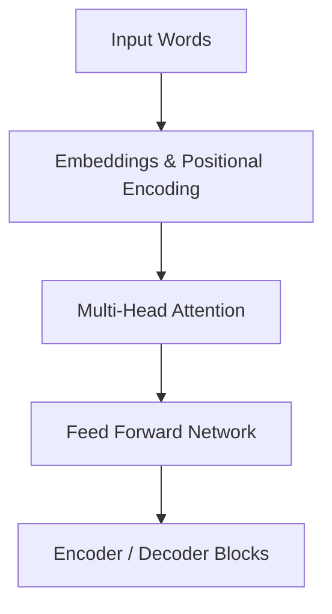

# 🎓 Educational Transformer Architecture

**TLDR:** Overview of the core architecture and design principles.

<details>
<summary>What makes this Transformer special?</summary>

Our `educational-transformer` project is designed to be a clear, commented, from-scratch implementation of the original "Attention Is All You Need" architecture. It breaks down the math into readable Python modules so you can learn exactly how the pieces fit together!

</details>

## 🧠 The Core Components



### What do they do?

| Component | What it is | Kid-Friendly Analogy |
|---|---|---|
| **Embeddings** | Turning words into a list of numbers the computer understands. | Assigning a unique coordinate to every word on a giant map. |
| **Positional Encoding** | Adding a "time stamp" to words so order matters. | Numbering the pages of a book so you know which comes first. |
| **Multi-Head Attention** | Looking at all other words in a sentence to understand context. | A group of detectives each looking at different clues in a room. |
| **Feed Forward** | A standard neural network layer that processes the attention output. | A factory assembly line that polishes the final product. |

<details>
<summary>💻 See the Code (How we build it)</summary>

In our `modules/attention.py`, we implement the famous Scaled Dot-Product Attention:

```python
import torch
import math

def attention(q: torch.Tensor, k: torch.Tensor, v: torch.Tensor, mask: torch.Tensor = None):
    # Get the dimension of the keys
    d_k = q.size(-1)
    
    # 1. Multiply Query and Key (How much does word A care about word B?)
    # (batch, h, seq_len, d_k) @ (batch, h, d_k, seq_len) -> (batch, h, seq_len, seq_len)
    scores = torch.matmul(q, k.transpose(-2, -1)) / math.sqrt(d_k)
    
    # 2. Apply Softmax to turn scores into percentages (weights)
    p_attn = torch.softmax(scores, dim=-1)
        
    # 3. Multiply by Value to get the final context
    output = torch.matmul(p_attn, v)
    
    return output, p_attn
```

</details>

## 📚 Resources for Deep Learning
- [Attention Is All You Need (Original Paper)](https://arxiv.org/abs/1706.03762)
- [The Illustrated Transformer](http://jalammar.github.io/illustrated-transformer/)
