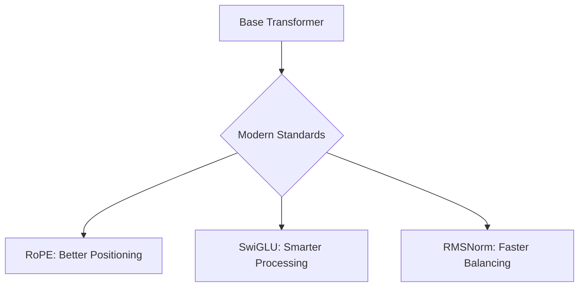

# 🧩 Minimal LLM Architecture

**TLDR:** Overview of the core architecture and design principles.

<details>
<summary>What makes this Minimal Model special?</summary>

Our `scratch-llm-minimal` project is designed to be the simplest possible implementation of a modern Large Language Model. We stripped away complex state-of-the-art optimizations to focus purely on the core mechanics!

However, to make the model actually functional, we kept a few fundamental building blocks that have become standard in modern models like LLaMA.
</details>

## 🧠 The Core Components



### What do they do?

| Component | What it is | Kid-Friendly Analogy |
|---|---|---|
| **RoPE (Rotary Embeddings)** | Math that rotates words to figure out how far apart they are. | Sitting in a circle and knowing exactly how many seats away your friend is. |
| **SwiGLU** | A smarter activation function (lightbulb) in the brain. | A dimmer switch instead of just an ON/OFF button. |
| **RMSNorm** | A faster way to normalize (balance) numbers. | Using a quick scale to weigh things instead of a slow, complicated scale. |
| **Pre-Norm** | Balancing the numbers *before* thinking about them, instead of after. | Putting on your glasses *before* you read the book! |

<details>
<summary>💻 See the Code (How we build it)</summary>

In our `llm/model.py`, we implemented these components as simply as possible:

```python
import torch
import torch.nn as nn

# 1. RMSNorm: The fast balancer
class RMSNorm(nn.Module):
    def __init__(self, dim: int, eps: float = 1e-5):
        super().__init__()
        self.eps = eps
        self.weight = nn.Parameter(torch.ones(dim))

    def _norm(self, x):
        # We only scale the numbers, we don't subtract the mean! Faster!
        return x * torch.rsqrt(x.pow(2).mean(-1, keepdim=True) + self.eps)

    def forward(self, x):
        return self._norm(x.float()).type_as(x) * self.weight

# 2. SwiGLU: The smart lightbulb
class SwiGLU(nn.Module):
    def __init__(self, d_model, hidden_dim):
        super().__init__()
        self.w1 = nn.Linear(d_model, hidden_dim, bias=False)
        self.w2 = nn.Linear(hidden_dim, d_model, bias=False)
        self.w3 = nn.Linear(d_model, hidden_dim, bias=False)

    def forward(self, x):
        # Using SiLU (Swish) instead of simple ReLU
        return self.w2(nn.functional.silu(self.w1(x)) * self.w3(x))
```

</details>

## 📚 Resources for Deep Learning
- [RoFormer: Enhanced Transformer with Rotary Position Embedding (RoPE)](https://arxiv.org/abs/2104.09864)
- [Root Mean Square Layer Normalization (RMSNorm)](https://arxiv.org/abs/1910.07467)
- [GLU Variants Improve Transformer (SwiGLU)](https://arxiv.org/abs/2002.05202)
