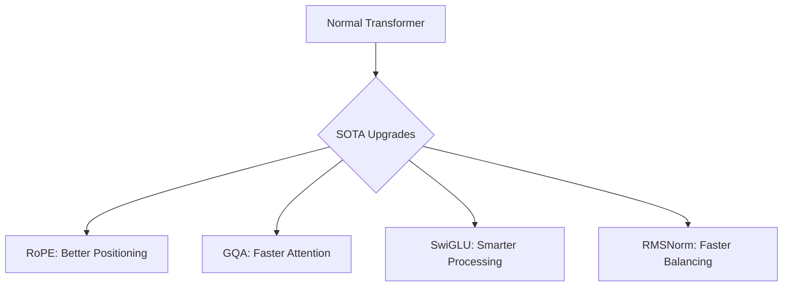

# 🚀 SOTA Architecture Upgrades

**TLDR:** Overview of the core architecture and design principles.

<details>
<summary>What makes a SOTA Model special?</summary>

SOTA stands for **State-of-the-Art**. It means "the best in the world right now."
Modern models like LLaMA and Mistral use the same basic Transformer brain we talked about, but with a few very clever upgrades! 
We use these exact same upgrades in our `scratch-llm` project!

</details>

## 🧠 The Brain Upgrades



### What do they do?

| Upgrade | What it is | Kid-Friendly Analogy |
|---|---|---|
| **Grouped Query Attention (GQA)** | Splitting the brain's focus into "groups" to save memory. | Instead of 10 teachers watching 10 kids, 1 teacher watches a group of kids. |
| **KV Cache** | Remembering past words during generation so it doesn't have to rethink everything. | Keeping a bookmark so you don't have to re-read the whole book every time you turn a page! |
| **RoPE (Rotary Embeddings)** | Math that rotates words to figure out how far apart they are. | Sitting in a circle and knowing exactly how many seats away your friend is. |
| **RMSNorm** | A faster way to normalize (balance) numbers. | Using a quick scale to weigh things instead of a slow, complicated scale. |
| **Pre-Norm** | Balancing the numbers *before* thinking about them, instead of after. | Putting on your glasses *before* you read the book! |
| **SwiGLU** | A smarter activation function (lightbulb) in the brain. | A dimmer switch instead of just an ON/OFF button. |

<details>
<summary>💻 See the Code (How we build it)</summary>

In our `llm/model.py`, we implemented these upgrades just like the big companies do:

```python
import torch
import torch.nn as nn

# 1. RMSNorm: The fast balancer
class RMSNorm(nn.Module):
    def __init__(self, dim: int, eps: float = 1e-5):
        super().__init__()
        self.eps = eps
        self.weight = nn.Parameter(torch.ones(dim))

    def _norm(self, x):
        # We only scale the numbers, we don't subtract the mean! Faster!
        return x * torch.rsqrt(x.pow(2).mean(-1, keepdim=True) + self.eps)

    def forward(self, x):
        return self._norm(x.float()).type_as(x) * self.weight

# 2. SwiGLU: The smart lightbulb
class SwiGLU(nn.Module):
    def __init__(self, d_model, hidden_dim):
        super().__init__()
        self.w1 = nn.Linear(d_model, hidden_dim, bias=False)
        self.w2 = nn.Linear(hidden_dim, d_model, bias=False)
        self.w3 = nn.Linear(d_model, hidden_dim, bias=False)

    def forward(self, x):
        # Using SiLU (Swish) instead of simple ReLU
        return self.w2(nn.functional.silu(self.w1(x)) * self.w3(x))
```

</details>

## 📚 Resources for Deep Learning
- [GQA: Training Generalized Multi-Query Transformer Models](https://arxiv.org/abs/2305.13245)
- [Efficient Memory Management for Large Language Model Serving (KV Cache / PagedAttention)](https://arxiv.org/abs/2309.06180)
- [RoFormer: Enhanced Transformer with Rotary Position Embedding](https://arxiv.org/abs/2104.09864)
