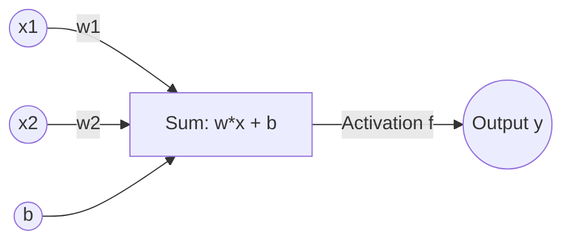

# 🤖 Tutorial 03: Neural Networks & MLPs

A neural network is a mathematical function that maps inputs to outputs through layers of calculations. By combining simple components—neurons, activation functions, and layers—we can build models that learn to recognize complex patterns.

---

## 1. The Artificial Neuron

An artificial neuron mimics a biological neuron. It takes inputs, applies weights (importance coefficients), adds a bias (baseline threshold), and applies an activation function.



### Mathematical Equation
$$y = f\left( \sum_{i=1}^{n} w_i x_i + b \right)$$

---

## 2. Activation Functions

Without activation functions, a neural network is just a giant linear regression model. Activation functions introduce **non-linearity**, allowing the network to fit non-linear patterns.

### A. Rectified Linear Unit (ReLU)
Outputs the input directly if it is positive; otherwise, it outputs zero.
$$f(x) = \max(0, x)$$
*Derivative*: $f'(x) = 1$ if $x > 0$ else $0$.

### B. Hyperbolic Tangent (Tanh)
Squashes inputs to a range between $-1$ and $1$.
$$f(x) = \tanh(x) = \frac{e^{2x} - 1}{e^{2x} + 1}$$
*Derivative*: $f'(x) = 1 - \tanh^2(x)$.

### C. Sigmoid
Squashes inputs to a range between $0$ and $1$. Useful for binary classification probabilities.
$$f(x) = \sigma(x) = \frac{1}{1 + e^{-x}}$$
*Derivative*: $f'(x) = \sigma(x)(1 - \sigma(x))$.

*Code reference*: [Activation functions in autograd.py](file:///home/ubuntu/playground/practice-llm/apps/basics/src/autograd.py#L66-L95)

---

## 3. Network Architecture

A **Multi-Layer Perceptron (MLP)** organizes neurons into layers:
1. **Input Layer**: Takes raw features.
2. **Hidden Layers**: Process features into abstract representations.
3. **Output Layer**: Outputs predictions.

In an MLP, every neuron in layer $L$ is connected to every neuron in layer $L-1$ (Fully Connected or Dense).

*Code reference*: [`Neuron`, `Layer`, and `MLP` in nn.py](file:///home/ubuntu/playground/practice-llm/apps/basics/src/nn.py#L16-L65)

---

## 4. The Training Loop

Training a neural network is an iterative process:

1. **Forward Pass**: Feed inputs through the layers to calculate predictions:
   ```python
   ypred = [model(x) for x in xs]
   ```
2. **Loss Calculation**: Compute how far predictions are from targets (e.g. Mean Squared Error):
   $$Loss = \frac{1}{N} \sum (y_{pred} - y_{target})^2$$
3. **Zero Gradients**: Clear gradients from the previous step to avoid compounding:
   ```python
   model.zero_grad()
   ```
4. **Backward Pass**: Backpropagate loss to calculate parameter gradients:
   ```python
   loss.backward()
   ```
5. **Parameter Update**: Adjust parameters in the opposite direction of the gradient:
   $$W \leftarrow W - \alpha \cdot \frac{\partial Loss}{\partial W}$$
   where $\alpha$ is the learning rate.
   ```python
   for p in model.parameters():
       p.data -= learning_rate * p.grad
   ```

*Code reference*: [XOR training loop in nn.py](file:///home/ubuntu/playground/practice-llm/apps/basics/src/nn.py#L68-L101)

---

## 💡 Practical Challenge
Run `task run -- src/nn.py`. Observe the loss decreasing. Change the architecture in `nn.py` (e.g. change hidden layers or learning rate) and see how it affects training speed and convergence.
