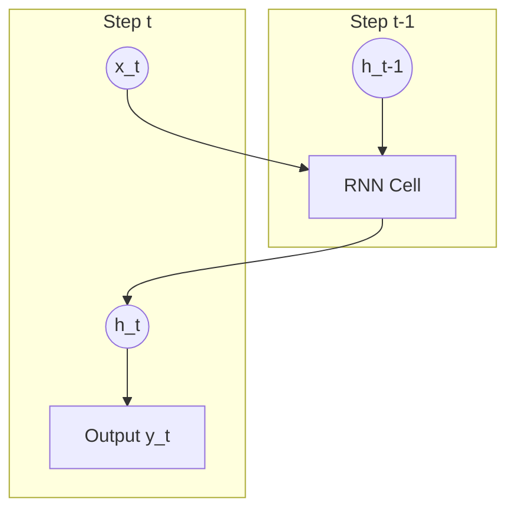

# 🔄 Tutorial 05: Recurrent Neural Networks (RNNs)

Language is inherently sequential. Words gain meaning from the words that precede them. Standard feed-forward networks (MLPs) take a fixed-size input and process it all at once. To process sequences of varying lengths, we need architectures that maintain memory.

---

## 1. Traditional Sequence Models

* **Markov Chains**: Models that assume the probability of the next word depends only on the current word:
  $$P(w_t \mid w_{t-1}, w_{t-2}, \dots) = P(w_t \mid w_{t-1})$$
* **N-grams**: Models that look back $N-1$ words. For example, a bigram model ($N=2$) predicts $w_t$ using only $w_{t-1}$. While simple, they cannot capture long-term context (e.g., matching a closing parenthesis pages later).

---

## 2. Recurrent Neural Networks (RNNs)

An RNN processes sequences step-by-step. At each time step $t$, it combines the current input vector $x_t$ with its hidden state from the previous step $h_{t-1}$ to update its memory $h_t$:



### Recurrent Equations
1. **Hidden State Update**:
   $$h_t = \tanh(x_t \mathbf{W}_{xh}^T + h_{t-1} \mathbf{W}_{hh}^T + b_h)$$
2. **Output Prediction**:
   $$y_t = h_t \mathbf{W}_{hy}^T + b_y$$

*Code reference*: [`RNNCell` in sequence.py](../src/sequence.py#L7-L22)

---

## 3. Unrolling an RNN Over Time

When training, we can visualize the RNN by "unrolling" the loop over the sequence length:

```text
Inputs:      x_1  ---->  x_2  ---->  x_3
              |           |           |
              v           v           v
Memory:  h_0 --> h_1 --> h_2 --> h_3
              |           |           |
              v           v           v
Outputs:     y_1         y_2         y_3
```

By unrolling, we see that the network behaves like an extremely deep feed-forward network where weight parameters ($\mathbf{W}_{xh}, \mathbf{W}_{hh}, \mathbf{W}_{hy}$) are shared across all steps.

*Code reference*: [Embedding and unrolled loop in RNNLanguageModel](../src/sequence.py#L24-L58)

---

## 4. Limitations of RNNs

* **Vanishing / Exploding Gradients**: Because inputs are multiplied by the same weight matrix $\mathbf{W}_{hh}$ at every step, gradients must flow backwards through time. If the weights are small, gradients vanish to zero; if weights are large, they explode.
* **Sequential Bottleneck**: Because $h_t$ requires $h_{t-1}$, we cannot compute steps in parallel during training. This makes RNNs slow to train on large GPUs.

---

## 💡 Practical Challenge
Run `task run -- src/sequence.py`. Observe the text generated by the model. Try extending the text corpus in `sequence.py` and adjusting the hidden size to see how it improves spelling and vocabulary coherence.
