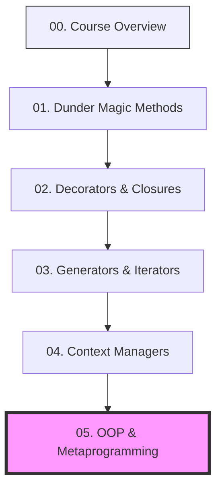

# 🎓 Python Concepts Overview: Mastering Advanced Python for Machine Learning

Welcome to the **Advanced Python Concepts** learning curriculum! 

This educational path is structured as a sequential ladder to help you master Python features crucial to writing clean, performant, and modular deep learning libraries. Rather than using these constructs blindly, you will study concrete Python source files, build classes, and run unit tests for each.

---

## 🗺️ The Learning Ladder

Click on any step below to open its dedicated deep-dive tutorial. We recommend following them in this exact order:

---

## 🗂️ Curriculum Syllabus

### [01. Dunder Magic Methods](01_dunder_methods.md)
* **What you'll learn**: Double-underscore (dunder) methods in Python, operator overloading, representations, indexing/slicing, and callability.
* **Code implemented in**: [dunder_methods.py](../src/dunder_methods.py)

### [02. Decorators & Closures](02_decorators.md)
* **What you'll learn**: Lexical scoping, nested functions, closures, function wrapper decorators, parameterizable decorator factories, and decorator stacking.
* **Code implemented in**: [decorators.py](../src/decorators.py)

### [03. Generators & Iterators](03_generators.md)
* **What you'll learn**: The Iterator Protocol (`__iter__`/`__next__`), lazy evaluation, generators using `yield`, and streaming pipeline patterns.
* **Code implemented in**: [generators.py](../src/generators.py)

### [04. Context Managers](04_context_managers.md)
* **What you'll learn**: The context manager protocol (`__enter__`/`__exit__`), exceptions management, state scopes, and `contextlib.contextmanager`.
* **Code implemented in**: [context_managers.py](../src/context_managers.py)

### [05. OOP & Metaprogramming](05_oop_meta.md)
* **What you'll learn**: Abstract Base Classes, property descriptors, multiple inheritance, Method Resolution Order (MRO), metaclasses, and dynamic registry design.
* **Code implemented in**: [oop_meta.py](../src/oop_meta.py)
