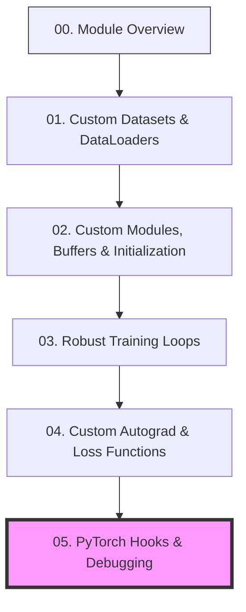

# 🎓 PyTorch Patterns: Advanced Deep Learning Workflows

**TLDR:** Learning curriculum syllabus and guides for advanced PyTorch programming patterns.

Welcome to the **PyTorch Patterns** learning module! This project is designed to help you transition from using basic PyTorch code to mastering clean, professional, and customizable workflows. 

Rather than relying on default settings, you will learn how PyTorch works under the hood by implementing custom dataset collators, custom module lifecycle layers with tracking buffers, structured training loops, custom mathematical autograd functions, and non-intrusive model inspection hooks.

---

## 🗺️ The Learning Ladder

Click on any step below to open its dedicated tutorial. We recommend following them in this exact order:

---

## 🗂️ Curriculum Syllabus

### [01. Custom Datasets & DataLoaders](01_custom_datasets.md)
* **What you'll learn**: Custom indexing, mapping data vocabularies, batch collation, and dynamic padding of variable-length sequence inputs.
* **Code implemented in**: [custom_dataset.py](../src/custom_dataset.py)

### [02. Custom Modules, Buffers & Initialization](02_custom_modules.md)
* **What you'll learn**: Training vs tracking state, using `nn.Parameter` and `register_buffer`, and manually initializing model parameters using Xavier/Kaiming distributions.
* **Code implemented in**: [custom_module.py](../src/custom_module.py)

### [03. Robust Training Loops](03_training_loops.md)
* **What you'll learn**: Structured training cycle management, train/eval state updates, optimizer steps, learning rate decay scheduling, and gradient norm clipping.
* **Code implemented in**: [training_loop.py](../src/training_loop.py)

### [04. Custom Autograd & Loss Functions](04_custom_autograd_loss.md)
* **What you'll learn**: Subclassing `torch.autograd.Function` to write custom forward/backward math passes (Gradient Reversal) and implementing custom loss modules (Focal Loss).
* **Code implemented in**: [custom_autograd.py](../src/custom_autograd.py)

### [05. PyTorch Hooks & Debugging](05_pytorch_hooks.md)
* **What you'll learn**: Non-intrusive network introspection, register forward/backward hooks, extracting internal activations, and computing gradient stats during runtime.
* **Code implemented in**: [hooks_debug.py](../src/hooks_debug.py)
