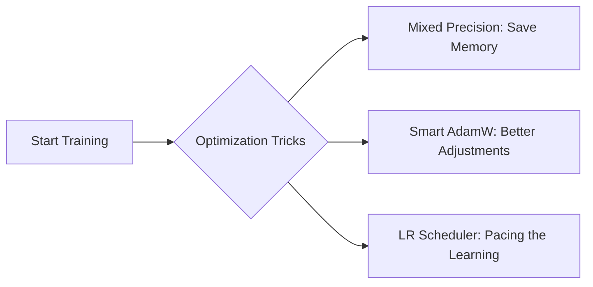

# 🏋️ SOTA Training & Optimization

<details>
<summary>Why do we need optimization?</summary>

Training a massive brain takes a LOT of energy and memory. If we just turn it on and hope for the best, the computer might crash or the brain might get confused!

We use "optimization" tricks to make the training faster, safer, and use less memory. Our `scratch-llm` uses the exact same tricks as the big companies!

</details>

## 🛠️ The Teacher's Tricks



### What do they do?

| Trick | What it is | Kid-Friendly Analogy |
|---|---|---|
| **Mixed Precision (AMP)** | Using smaller numbers (BFloat16) to save space without losing quality. | Writing notes in shorthand so you can fit more on a page! |
| **Advanced AdamW Optimizer** | A super-smart tutor that knows *exactly* which knobs in the brain to twist, and which ones to leave alone. | A tutor who knows you need help with Math, but leaves your good Reading skills alone! |
| **LR Scheduler (Warmup & Decay)** | Changing how fast the brain learns over time. Fast at first, then slow and careful. | Starting a run with a slow jog, sprinting in the middle, and slowing down to a walk at the end. |
| **BPE Tokenizer** | A smart dictionary that breaks weird words into pieces instead of giving up. | If you don't know the word "Unbelievable", breaking it into "Un-believe-able" to figure it out. |
| **Gradient Clipping** | Stopping the brain from making adjustments that are way too big. | Putting a speed limit on a toy car so it doesn't crash into the wall! |

<details>
<summary>💻 See the Code (How we optimize)</summary>

In our `scripts/train.py`, we implement these tricks like this:

```python
import torch
import math
from torch.optim.lr_scheduler import LambdaLR

# 1. LR Scheduler (Pacing the Learning)
def get_lr_scheduler(optimizer, warmup_steps, total_steps):
    def lr_lambda(current_step):
        # Phase 1: Linear Warmup (Jogging to start)
        if current_step < warmup_steps:
            return float(current_step) / float(max(1, warmup_steps))
            
        # Phase 2: Cosine Decay (Slowing down to a walk at the end)
        progress = float(current_step - warmup_steps) / float(max(1, total_steps - warmup_steps))
        return max(0.1, 0.5 * (1.0 + math.cos(math.pi * progress)))
    
    return LambdaLR(optimizer, lr_lambda)

# 2. Gradient Clipping (The Speed Limit)
# In the training loop, we cap the errors so the brain doesn't overreact!
# torch.nn.utils.clip_grad_norm_(model.parameters(), max_norm=1.0)
```

</details>

## 📚 Resources for Deep Learning
- [PyTorch Automatic Mixed Precision (AMP) Examples](https://pytorch.org/tutorials/recipes/recipes/amp_recipe.html)
- [SGDR: Stochastic Gradient Descent with Warm Restarts (Cosine Annealing)](https://arxiv.org/abs/1608.03983)
- [Understanding Gradient Clipping](https://neptune.ai/blog/understanding-gradient-clipping-and-how-it-can-fix-exploding-gradients-problem)
