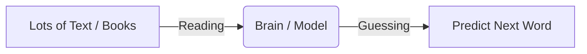

# 1. What is an LLM?

Click here to read what an LLM is!

An LLM (Large Language Model) is like a super-smart robot parrot. It reads a ton of text and learns to play a simple game: **Guess the next word!**

If you say "The sky is...", it will guess "...blue!"

By getting really good at this simple game, it learns grammar, facts, and even how to write code.

## How it works

### The Three Stages

| Concept | What it means | Real-World Example |
|---|---|---|
| **Dataset** | All the books, websites, and articles it reads. | Wikipedia, Reddit, Books |
| **Training** | The process of reading and finding patterns. | Studying for a huge exam |
| **Inference** | Actually answering your questions. | Taking the exam |
