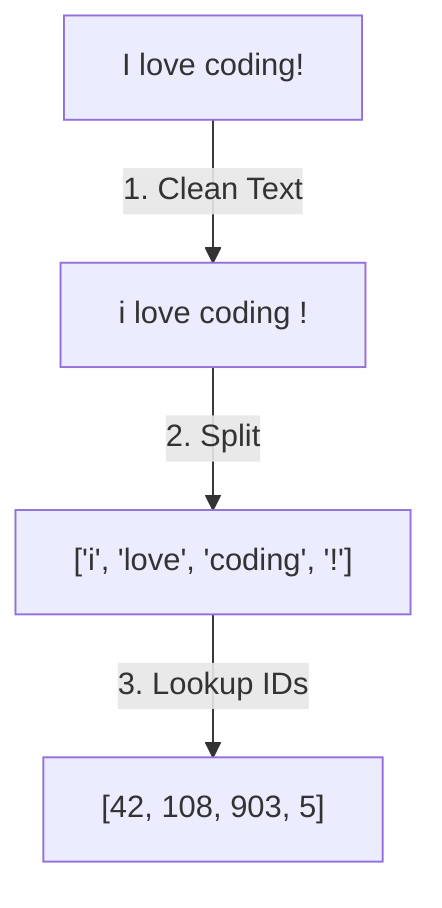

# 2. Data Preparation: Turning Words into Numbers

Why do we need to prepare data?

Computers are super calculators. They only understand **numbers**, not English letters or words!

Before our AI brain can learn from books, we have to translate all the words into lists of numbers. This translation process is called **Tokenization**. 

Imagine giving every word in the dictionary its own secret ID badge number.

## Tokenization Flow

### The Preparation Steps

| Step | Action | Kid-friendly Analogy |
|---|---|---|
| **1. Collect** | Gather a bunch of text. | Going to the library and grabbing a huge stack of books. |
| **2. Clean** | Remove weird symbols or messy text. | Wiping the dirt off old book covers so they are easy to read. |
| **3. Tokenize** | Split text into pieces (tokens). | Chopping a chocolate bar into tiny squares. |
| **4. Encode** | Give each piece a number ID. | Giving each square a barcode. |

Scaling up to SOTA (State of the Art)

When building models like GPT-4 or LLaMA, this step is basically the exact same! 
The only difference is that instead of using one little book, they download the entire internet (petabytes of text!) and use a very smart dictionary (like Byte-Pair Encoding) to chop up words more efficiently.

