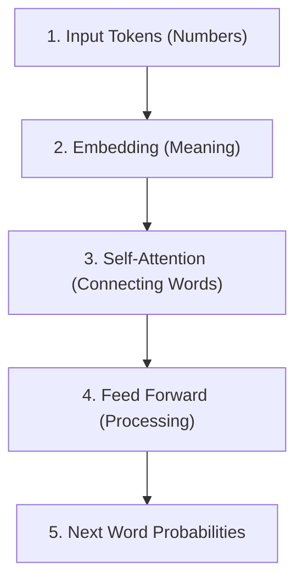

# 3. The Transformer: The Brain's Engine

<details>
<summary>What is a Transformer?</summary>

The **Transformer** is the secret sauce inside modern AI. It's the engine that powers everything. 

Its superpower is called **Self-Attention**. 

If a sentence says: *"The cat didn't cross the street because it was too tired."*
What does the word *"it"* mean? Is the street tired? Or the cat? 
Self-Attention lets the AI look back at the word *"cat"* and draw an invisible connecting line between *"cat"* and *"it"*. It learns to pay attention to the right things!

</details>

## Inside the Transformer



### The Brain's Components

| Part | What it does | Kid-friendly Analogy |
|---|---|---|
| **Embedding** | Turns plain numbers into a list of meaning-traits. | Filling out a personality profile card for every word. |
| **Attention** | Looks at all other words in the sentence to find context. | Being in a crowded room and figuring out who is talking to who. |
| **Feed Forward** | A mini-brain that processes the context it just found. | Thinking really hard about a clue. |
| **Probabilities** | A list of percentages for what the next word could be. | Rolling loaded dice to pick the next word! |

<details>
<summary>💻 See the Code (How we build the brain)</summary>

In our `llm/model.py`, we build these parts using PyTorch, which is like LEGO bricks for AI!

```python
import torch.nn as nn

# 1. The whole Brain is made of layers
class SwiGLU(nn.Module):
    # This is the "Feed Forward" mini-brain that processes context
    def __init__(self, d_model, hidden_dim):
        super().__init__()
        self.w1 = nn.Linear(d_model, hidden_dim, bias=False)
        self.w2 = nn.Linear(hidden_dim, d_model, bias=False)
        self.w3 = nn.Linear(d_model, hidden_dim, bias=False)

    def forward(self, x):
        # We multiply numbers and apply an activation function (like turning a lightbulb on/off)
        return self.w2(nn.functional.silu(self.w1(x)) * self.w3(x))
```

To make it smarter, we just stack more of these layers together!

</details>

<details>
<summary>Scaling up to SOTA (State of the Art)</summary>

When building the biggest models, the math in this engine is EXACTLY the same! 
To make it smarter, they just stack more layers of Attention and Feed Forward blocks on top of each other. A small model might have 4 layers. A huge model like GPT might have 96 or more layers!

</details>
