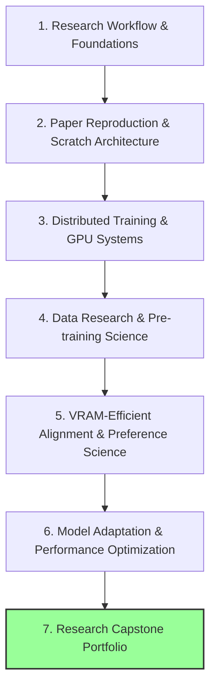

# 🔬 AI Research Lab Roadmap: Mastering Frontier AI Science

This roadmap is specifically tailored for transitioning into top-tier AI research labs (e.g., DeepMind, Anthropic, OpenAI, FAIR) by mastering hypothesis-driven deep learning research, distributed training, optimization math, and evaluation science.

---

## 🔍 Part 1: Current State Assessment
You have completed the foundational requirements for deep learning and transformers:
* **Python Concepts**: Advanced constructs, OOP meta-programming, decorators, and context managers.
* **DL & Transformers from Scratch**: Matrix math, custom Autograd engine, custom neural library (MLPs), sequence models (RNN), attention mechanisms, and a Decoder-only Tiny GPT.
* **PyTorch Production Patterns**: Custom datasets, hooks, loss functions, custom collate functions.
* **Transformer Architectures**: Full encoder-decoder structures.

---

## 🗺️ Part 2: The AI Research Mastery Path
To become a top-tier AI researcher, you must master the entire research pipeline: from hypothesis formulation and paper reproduction to scaling behavior, distributed GPU execution, and alignment evaluation.

---

## 📚 Detailed Mastery Domains

### 1. Research Methodology & Core Foundations
* **Research Workflow**: Hypothesis-driven development (hypothesis → experiment → analysis), systematic benchmarking, and ablation study design.
* **Experiment Tracking**: Integration with tools like Weights & Biases (W&B) and MLflow.
* **Math & Autograd**: Vector calculus, linear algebra, probability theory, computational graph design.
* **Completed in Codebase**: Custom Autograd (`src/autograd.py`), custom Matrix library (`src/matrix.py`).

### 2. Paper Reproduction & Scratch Architecture
* **Paper Reproduction Pipeline**: Reimplementing paper architectures, debugging training runs, hyperparameter tuning, and matching benchmark results.
* **Core Transformer Mechanics**: Encoder-Decoder blocks, causal masking, residual streams, layernorm placement (Pre-LN vs Post-LN), rotary embeddings (RoPE).
* **Prioritized Architectural Refactoring**: Prioritize upgrading the existing repository with Grouped-Query Attention (GQA) and Rotary Position Embeddings (RoPE) before exploring alternative paradigms.
* **Evaluation Integration**: Implementing basic token-level loss tracking, downstream classification evaluation, and generation evaluations alongside every phase.

### 3. Distributed Training & GPU Systems
* **Distributed Infrastructures**: Distributed Data Parallel (DDP), Fully Sharded Data Parallel (FSDP), ZeRO redundancy optimizer.
* **Parallelism Strategies**: Tensor parallelism, pipeline parallelism.
* **GPU Compute & Systems**: CUDA programming fundamentals, writing Triton kernels, profiling GPU workloads (NSight, PyTorch Profiler).

### 4. Data Engineering & Pre-training Science
* **Data Research & Engineering**: Semantic deduplication (MinHash/LSH), heuristic quality filters (perplexity, character/word ratios), tokenization edge cases, curriculum learning, dataset pruning, data attribution, and synthetic data generation pipelines.
* **Scaling Laws & Training Dynamics**: Chinchilla scaling laws, compute-optimal training allocation, stabilizing pre-training at scale (exploding/vanishing gradients, loss spikes).
* **Alternative & Hybrid Architectures** *(Reduced Priority)*: Mamba / State Space Models (SSMs), Retrieval-Augmented Generation (RAG) models, and hybrid architectures.
* **Pre-training Evaluation**: Dynamic evaluation metrics, cross-entropy validation, downstream benchmark suite evaluation during pre-training checkpoints.

### 5. VRAM-Efficient Alignment & Preference Science
* **Optimization Algorithms**: Internals of AdamW, learning rate schedules (cosine decay, warmup), gradient clipping, mixed-precision (FP16, BF16, FP8).
* **Preference Math & Alignment**: Direct Preference Optimization (DPO) mathematical derivations, ORPO, Kahneman-Tversky Optimization (KTO).
* **VRAM-Efficient Reinforcement Learning**: Group Relative Policy Optimization (GRPO) to learn alignment without the memory overhead of a separate critic network.
* **Reward Hacking Guardrails**: KL-divergence penalty mechanics in policy optimization to prevent policy drift and model collapse during PPO/GRPO training.
* **Evaluation Science**: Human evaluation methodologies, LLM-as-judge frameworks, and alignment evaluation benchmarks.

### 6. Model Refinement & Adaptation *(Reduced Priority)*
* **Model Merging**: Weight interpolation techniques (SLERP, TIES, DARE) to combine distinct model capabilities with zero GPU cost.
* **Downcycling**: Upgrading dense weights to sparse Mixture of Experts (MoE) architectures.
* **Depth & Width Transformations**: Model layer stacking (e.g. SOLAR-10.7B) and progressive layer pruning.
* **Byte-Level Models**: Token-free autoregressive modeling (Mamba-Byte) to process raw binary data.

### 7. Performance & Edge Optimization
* **Memory vs. Compute Profiling**: Separating optimizations into:
  * **Compute-Bound**: Prefill phase, standard matrix multiplication, FlashAttention kernels.
  * **Memory-Bandwidth-Bound**: Decoding phase, KV-cache lookup, GQA, MLA.
* **Quantization Mechanics**: PTQ (Post-Training Quantization), QAT (Quantization-Aware Training), ternary/binary weight systems (BitNet 1-bit models).
* **Speedup & Decoding**: Speculative decoding, Multi-Token Prediction (MTP) drafting, and NPU-native kernel compilation (e.g., Apple MLX, Qualcomm Hexagon).

---

## 🏆 Final Capstone Milestone
* **Paper Re-implementation**: Reproduce 5-10 major AI papers from scratch and write clean technical reports.
* **Checkpoints**: Release trained models and checkpoints on Hugging Face.
* **Open Source**: Contribute to major open-source AI infrastructure projects (e.g., vLLM, transformers, deepspeed, triton).
