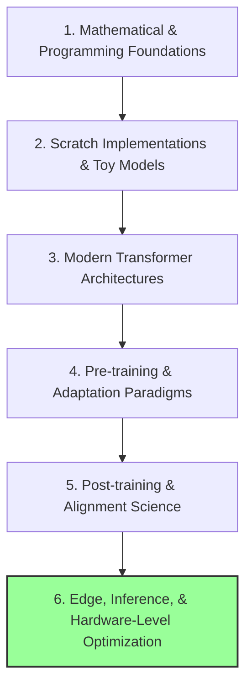

# 🌌 Deep Learning Systems & Architectures Roadmap

This roadmap is designed for engineers seeking to master the **internal mechanics and systems** of deep learning by building libraries, architectures, Autograd engines, and customized Transformers from scratch.

---

## 🔍 Part 1: Current State Assessment
You have completed the foundational requirements for deep learning and transformers:
* **Python Concepts**: Advanced constructs, OOP meta-programming, decorators, and context managers.
* **DL & Transformers from Scratch**: Matrix math, custom Autograd engine, custom neural library (MLPs), sequence models (RNN), attention mechanisms, and a Decoder-only Tiny GPT.
* **PyTorch Production Patterns**: Custom datasets, hooks, loss functions, custom collate functions.
* **Transformer Architectures**: Full encoder-decoder structures.

---

## 🗺️ Part 2: The AI Systems Mastery Path
To master AI systems engineering, you must understand every layer of the execution stack: from base math and custom neural engines to pre-training mechanics, structural optimization, and hardware-level profiling.

---

## 📚 Detailed Mastery Domains

### 1. Mathematical & Coding Foundations
* **Concepts**: Vector calculus, linear algebra, probability theory, computational graph design.
* **Completed in Codebase**: Custom Autograd (`src/autograd.py`), custom Matrix library (`src/matrix.py`).

### 2. Architecture & Scratch Implementations
* **Concepts**: Encoder-Decoder blocks, causal masking, residual streams, layernorm placement (Pre-LN vs Post-LN), rotary embeddings (RoPE).
* **Completed in Codebase**: Decoder-only Tiny GPT (`src/gpt.py`), Transformer blocks (`modules/transformer.py`).
* **Architectural Refactoring (Priority)**: Prioritize upgrading the existing repository with Grouped-Query Attention (GQA) and Rotary Position Embeddings (RoPE) before exploring alternative paradigms.

### 3. Pre-training Paradigms & Data Engineering (Foundational Science)
* **Data Engineering for Pre-training**: Semantic deduplication (MinHash/LSH), heuristic quality filters (perplexity, character/word ratios), and tokenization edge cases.
* **Sparse Mixtures of Experts (MoE)**: Routing mechanics, load balancing losses, token gating (`megablocks`, DBRX, Mixtral).
* **Long-Context Scaling**: YaRN interpolation, RoPE frequency scaling, flash attention integration.
* **Dense Pre-training**: Learning curves, Chinchilla scaling laws, compute optimal training.
* **Byte-Level Models**: Token-free autoregressive modeling (Mamba-Byte) to process raw binary data.

### 4. Adaptation & Structural Modification
* **Model Merging**: Weight interpolation techniques (SLERP, TIES, DARE) to combine distinct model capabilities with zero GPU cost.
* **Downcycling**: Upgrading dense weights to sparse Mixture of Experts (MoE) architectures.
* **Depth & Width Transformations**: Model layer stacking (e.g. SOLAR-10.7B) and progressive layer pruning.
* **Attention Optimization**: Transitioning between MHA (Multi-Head Attention), GQA (Grouped-Query Attention), and MLA (Multi-head Latent Attention).

### 5. Alignment & Preference Optimization
* **Preference Math**: Direct Preference Optimization (DPO) mathematical derivations, ORPO, Kahneman-Tversky Optimization (KTO).
* **VRAM-Efficient Reinforcement Learning**: Group Relative Policy Optimization (GRPO) to learn alignment without the memory overhead of a separate critic network.
* **Reward Hacking Guardrails**: KL-divergence penalty mechanics in policy optimization to prevent policy drift and model collapse during PPO/GRPO training.
* **Other RL Methods**: PPO reasoning trajectories, reward-model training, and rejection sampling SFT.

### 6. Edge & Hardware-Level Optimization
* **Memory vs. Compute Profiling**: Separating optimizations into:
  * **Compute-Bound**: Prefill phase, standard matrix multiplication, FlashAttention kernels.
  * **Memory-Bandwidth-Bound**: Decoding phase, KV-cache lookup, GQA, MLA.
* **Quantization Mechanics**: PTQ (Post-Training Quantization), QAT (Quantization-Aware Training), ternary/binary weight systems (BitNet 1-bit models).
* **Speedup & Decoding**: Speculative decoding, Multi-Token Prediction (MTP) drafting, and NPU-native kernel compilation (e.g., Apple MLX, Qualcomm Hexagon).
