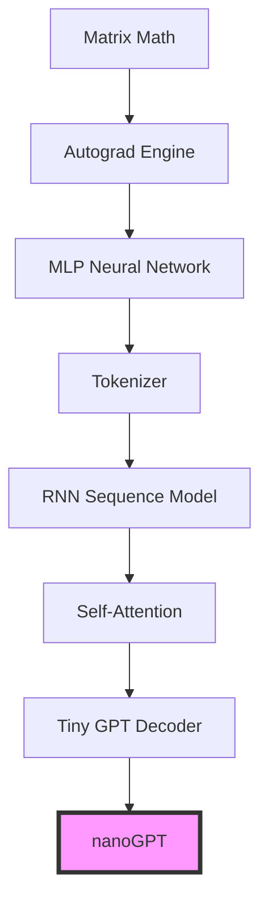
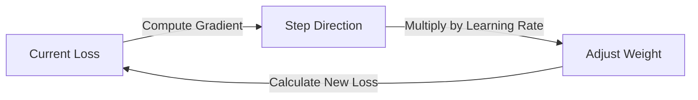
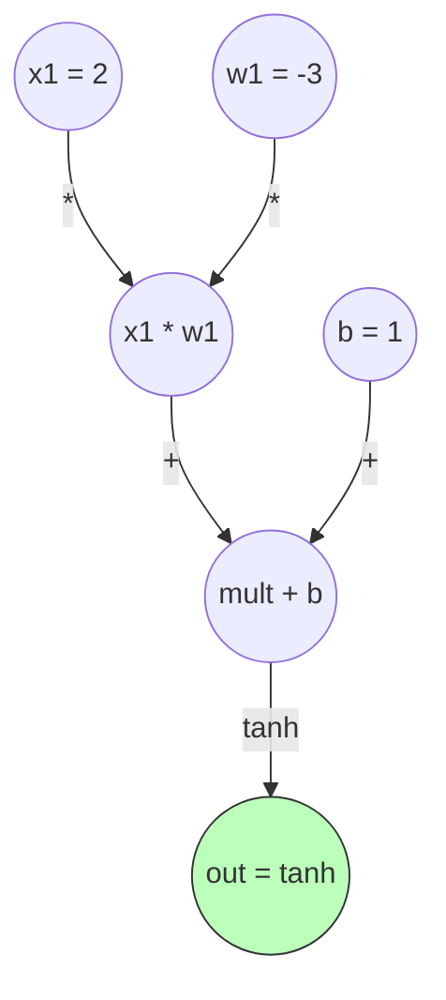
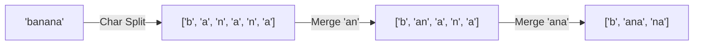
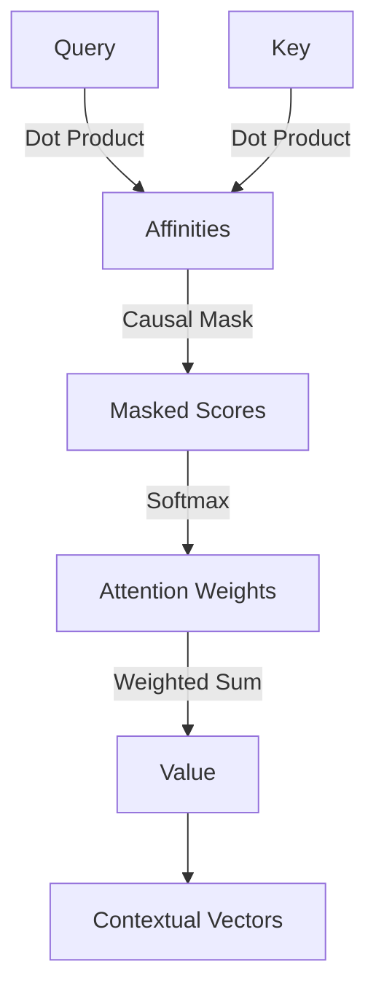

# 🎓 Foundations Roadmap: From Matrix Math to nanoGPT

This tutorial provides a step-by-step roadmap for mastering the core building blocks of modern deep learning and language models. By coding these concepts from scratch, you will bridge the gap between simple math equations and a production-ready Transformer architecture like nanoGPT.

---

## 🗺️ The Implementation Ladder

Here is your path to understanding the internals of LLMs. Follow this sequential ladder to build confidence step-by-step:

---

## 🗂️ 12-Phase Detailed Guide

### 🧬 Phase 1 & 2: Python, NumPy & Mathematical Foundations
To understand neural networks, we must first learn how to manipulate dimensions. Tensors are just multi-dimensional arrays, and the math operations inside a model are composed of matrix additions, multiplications, and transpositions.

💡 Read about Matrix Math Intuition

* **Scalars vs. Vectors vs. Matrices**: A scalar is a single number ($5$), a vector is a list of numbers ($[1, 2, 3]$), and a matrix is a grid of numbers.
* **Matrix Multiplication (Matmul)**: The core engine of Deep Learning. To multiply matrix $A$ and matrix $B$, we take the dot product of rows in $A$ and columns in $B$.
* **Mean & Variance**: Used in normalization layers to stabilize training by keeping inputs scaled and centered around 0.

#### 📊 Matrix Operation Summary

| Operation | Equation | Code Reference |
|---|---|---|
| Element-wise Add | $C_{ij} = A_{ij} + B_{ij}$ | [matrix.py](file:///home/ubuntu/playground/practice-llm/apps/basics/src/matrix.py#L38-L47) |
| Matrix Multiply | $C_{ij} = \sum_k A_{ik} B_{kj}$ | [matrix.py](file:///home/ubuntu/playground/practice-llm/apps/basics/src/matrix.py#L60-L75) |
| Transpose | $A^T_{ji} = A_{ij}$ | [matrix.py](file:///home/ubuntu/playground/practice-llm/apps/basics/src/matrix.py#L77-L83) |

---

### ⚙️ Phase 3: Calculus & Optimization
Learning in neural networks happens by adjusting weights to minimize errors. Calculus gives us the direction (gradients) to make these adjustments.

💡 Read about Gradients & Gradient Descent

* **Derivative**: Measures the rate of change. For a function $y = f(x)$, the derivative $dy/dx$ tells us how much $y$ changes when we nudge $x$.
* **Chain Rule**: The secret sauce of backpropagation. Allows us to calculate derivative of composite functions: $\frac{dy}{dx} = \frac{dy}{dz} \cdot \frac{dz}{dx}$.
* **Gradient Descent**: Taking small steps in the opposite direction of the gradient to find a minimum (using a step size called the **Learning Rate**).

---

### 🤖 Phase 4 & 5: Machine Learning & Custom Neural Network
We combine linear equations and non-linear "activations" to create neurons, layers, and networks.

💡 Read about Neurons and MLPs

A single neuron computes a weighted sum of inputs and passes it through an activation function (like Tanh or ReLU) to introduce non-linearity. This allows the network to fit complex, non-linear shapes (like the XOR logic gate).

* **Weights & Biases**: Parameters adjusted during training.
* **Loss Functions**: Functions measuring how far predictions are from target classes.
* **Forward Pass**: Running inputs through the layers to get predictions.
* **Backward Pass**: Backpropagating the error to compute weight updates.

See [nn.py](file:///home/ubuntu/playground/practice-llm/apps/basics/src/nn.py) to inspect how we build a full neural network library and solve the XOR problem from scratch!

---

### 🎛️ Phase 6: Automatic Differentiation (Autograd)
Writing gradients by hand for millions of parameters is impossible. We build a tool that tracks the computational graph of operations and calculates gradients automatically.

💡 Read about Computational Graphs & Autograd

When we write equations, our Autograd engine tracks the parents (children) of each resulting node and saves the operations. Calling `.backward()` traverses this graph in reverse order to populate `.grad` fields automatically via the chain rule.

Check out our custom autograd engine implementation in [autograd.py](file:///home/ubuntu/playground/practice-llm/apps/basics/src/autograd.py).

---

### 🛠️ Phase 7: PyTorch Foundations
Transition from custom Python code to PyTorch, a high-performance library that handles parallel tensor computations, automatically compiles computational graphs, and targets GPUs.

💡 Read about PyTorch Core Classes

| PyTorch Class | Description |
|---|---|
| `torch.Tensor` | High-dimensional array supporting autograd tracking (`requires_grad=True`). |
| `torch.nn.Module` | Base class for neural network layers and models. |
| `torch.optim` | Optimizers implementing gradient descent algorithms (like SGD, Adam, AdamW). |
| `torch.utils.data.DataLoader` | Handles mini-batch splits and data shuffling. |

---

### 🔤 Phase 8: NLP Foundations & Tokenization
Text must be mapped into lists of integers before entering our model.

💡 Read about Tokenization & Merges

* **Character Tokenizer**: Simple but produces very long sequences.
* **Byte Pair Encoding (BPE)**: A subword tokenizer that builds vocabulary iteratively by merging the most frequent adjacent byte/character pairs.

See [tokenizer.py](file:///home/ubuntu/playground/practice-llm/apps/basics/src/tokenizer.py) for the complete Char and BPE implementations from scratch!

---

### 🔄 Phase 9: Sequence Modeling (RNN)
Before attention, sequence models kept a "running summary" (hidden state) of what they read.

💡 Read about Recurrent Neural Networks

An RNN loops through the input sequence, combining the embedding of the current token with the hidden state from the previous step.
* **Limitations**: RNNs struggle with long-term memory because gradients vanish or explode over long sequences (e.g. reading a book).

Check out [sequence.py](file:///home/ubuntu/playground/practice-llm/apps/basics/src/sequence.py) to see our custom character prediction RNN in action!

---

### 🔍 Phase 10: Attention Mechanism
Rather than compressing a whole sequence into one running summary, Attention lets tokens look back at all prior tokens and choose which ones to focus on!

💡 Read about Query, Key, and Value Vectors

Each token projects its embedding into three roles:
1. **Query (Q)**: What information am I looking for?
2. **Key (K)**: What information do I contain?
3. **Value (V)**: If I am relevant, what information do I pass?

$$Attention(Q, K, V) = \text{softmax}\left(\frac{Q K^T}{\sqrt{d_k}}\right) V$$

* **Causal Masking**: We fill the upper triangle of attention weights with $-\infty$ so tokens cannot see future tokens.

Read our implementation of Single Head and Multi-Head Attention in [attention.py](file:///home/ubuntu/playground/practice-llm/apps/basics/src/attention.py).

---

### 🏗️ Phase 11: Transformer Block & Tiny GPT
We assemble the layers to construct a Decoder-Only Transformer (Tiny GPT).

💡 Read about Transformer Block & Residual Streams

* **Pre-LN Block**: Normalizes inputs before passing them to the attention or feed-forward network.
* **Residual Connections**: Adds the input back to the layer outputs, creating a "gradient highway" that enables deep stacks without gradient vanishing.
* **Context Window**: The maximum sequence length the positional encoding table supports.

Check out our modular Decoder-only Tiny GPT model in [gpt.py](file:///home/ubuntu/playground/practice-llm/apps/basics/src/gpt.py).

---

### ⛰️ Phase 12: nanoGPT Level
You are now ready to tackle Andrej Karpathy's `nanoGPT`. It is essentially the final assembly of the components you have just built:

* **model.py**: The model is a scaled-up version of our [TinyGPT](file:///home/ubuntu/playground/practice-llm/apps/basics/src/gpt.py#L33) featuring dropout layers, weight tying, and initialization adjustments.
* **train.py**: Training loop utilizing PyTorch data loaders, gradient accumulation, mixed-precision (AMP), and checkpointing.

---

## 📚 Recommended Resources
* [micrograd (Andrej Karpathy)](https://github.com/karpathy/micrograd)
* [nanoGPT (Andrej Karpathy)](https://github.com/karpathy/nanoGPT)
* [Deep Learning Specialization (Andrew Ng)](https://www.coursera.org/specializations/deep-learning)
